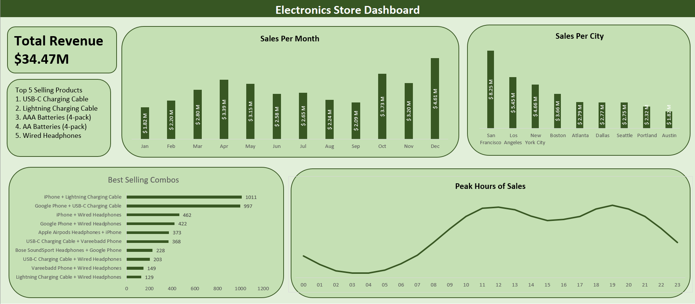

# Electronics Sales Dashboard

This project analyzes a sales dataset with over 180,000 records from the year 2019, sourced from a public GitHub repository. The goal was to derive meaningful business insights and present them through a visually compelling Excel dashboard.

## 🔍 Questions Answered

1. **What was the best month for sales? How much was earned that month?**  
   ➤ **December**, with total earnings of **$4.61 million**

2. **What city had the highest sales?**  
   ➤ **San Francisco**

3. **What time should we display advertisements to maximize customer purchases?**  
   ➤ Between **11 AM and 12 PM**

4. **What products are most often sold together?**  
   ➤ **iPhone + Lightning Charging Cable**

5. **What product sold the most? Why?**  
   ➤ **USB-C Charging Cable** – Possibly due to affordability and widespread compatibility

## 🛠 Tools Used

- **SQL**: For data cleaning, creating new columns (e.g., `Month`, `City`), and identifying frequently sold product combinations
- **Excel**: For building the interactive dashboard and visualizing insights

## 📊 Dashboard

The dashboard includes:
- Monthly sales trends
- City-wise sales breakdown
- Hourly sales heatmap
- Frequently sold product pairs
- Top-selling products

## 📁 Dataset

- Year: **2019**
- Records: **~180,000**
- Source: Public GitHub Repository

---

Feel free to reach out for collaboration or feedback!

